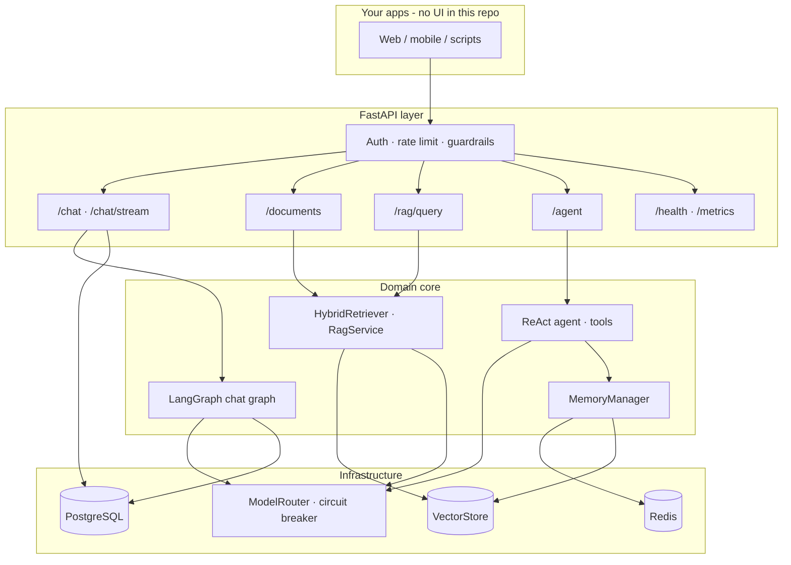

# Enterprise AI Agent Service

[](https://github.com/lordrance/AI-Agent-service/actions/workflows/ci.yml)

A **production-oriented, backend-only** AI agent platform built with **Python 3.11+** and **FastAPI**.  
There is **no bundled frontend** — you integrate via REST JSON and SSE. Ideal for **portfolio projects**, **system design interviews**, and **open-source demos** that show real agent engineering (not a thin ChatGPT wrapper).

> Application code lives in [`project-python/`](./project-python/). This repo also includes [BMAD Method](https://github.com/bmad-code-org/BMAD-METHOD) planning artifacts under `docs/planning-artifacts/`.

---

## Why this project stands out (interviews & OSS)

| Highlight | What it demonstrates |
|-----------|----------------------|
| **61 automated tests** | Unit, integration, E2E API, deploy smoke, Pinecone mocks, hybrid RAG |
| **CI pipeline** | Ruff, incremental mypy, pytest, **RAG golden-set gate (≥ 80% accuracy)**, Docker build, pip-audit |
| **Hexagonal-style layout** | `core/` (domain) vs `infrastructure/` (adapters) vs `api/` (HTTP) |
| **Hybrid RAG** | Vector search (Pinecone / pgvector) + BM25 + **RRF fusion** |
| **LangGraph + Postgres** | Durable multi-turn chat checkpoints |
| **Multi-tenant security** | API Key / JWT, rate limits, guardrails, tenant-scoped vectors |
| **Production paths** | Gunicorn, health/readiness, Prometheus, optional OTel OTLP |

---

## Architecture (high level)



### Data flow examples

**RAG query**

```
Question → embed → [vector top-K] + [BM25 top-K] → RRF merge → optional rerank → LLM answer with citations
```

**Chat (non-stream)**

```
Messages → guardrails → LangGraph → ModelRouter (retry / fallback) → Postgres checkpoint (thread_id = tenant:session)
```

---

## Capabilities

| API | Purpose |
|-----|---------|
| `POST /api/v1/chat` | Multi-turn chat with LangGraph persistence |
| `POST /api/v1/chat/stream` | SSE streaming; same guardrails + checkpoint semantics |
| `POST /api/v1/documents/upload` | Ingest PDF/TXT → chunk → embed → vector + metadata |
| `GET/DELETE /api/v1/documents` | Tenant-scoped list and delete (vectors included) |
| `POST /api/v1/rag/query` | Hybrid retrieval + optional grounded generation |
| `POST /api/v1/agent` | ReAct loop with tools; `use_memory: true` for Redis + vector memory |
| `GET /api/v1/health/ready` | DB, Redis, and vector store readiness |

Interactive docs: `http://localhost:8000/docs` after startup.

---

## Tech stack

| Layer | Choices |
|-------|---------|
| API | FastAPI, Gunicorn, Uvicorn |
| Agent orchestration | LangGraph, LangChain |
| Vectors (prod) | **Pinecone** (namespace per tenant) |
| Vectors (local / CI) | **pgvector** on PostgreSQL 16 |
| OLTP | PostgreSQL, SQLAlchemy, Alembic |
| Cache | Redis |
| LLM | OpenAI-compatible API + router (retry, circuit breaker, fallback models) |
| Observability | Prometheus, optional Langfuse, optional OpenTelemetry OTLP |

---

## Quick start

```bash
git clone https://github.com/lordrance/AI-Agent-service.git
cd AI-Agent-service/project-python

cp .env.example .env
# Set DATABASE_URL, REDIS_URL; set OPENAI_API_KEY for chat/RAG generation

python -m venv .venv && source .venv/bin/activate
pip install -r requirements.txt
pip install -e ".[dev]"
alembic upgrade head
uvicorn app.main:app --reload --port 8000
```

**Docker (recommended for demos):**

```bash
cd project-python
docker compose up -d --build
./scripts/smoke_deploy.sh http://127.0.0.1:8000
```

Full details: **[project-python/README.md](./project-python/README.md)**.

---

## Quality & CI

```bash
cd project-python
pytest tests/ -q                    # 61 tests
ruff check app tests scripts
python scripts/eval_rag_golden.py --mode pipeline --fail-under 0.8
```

GitHub Actions (`.github/workflows/ci.yml`) runs lint, tests, golden-set evaluation, and Docker build on every push/PR.

---

## Repository layout

```
├── project-python/           # Main FastAPI application ★
│   ├── app/api/              # HTTP routes & middleware
│   ├── app/core/             # Agent, RAG, memory, guardrails, LangGraph
│   ├── app/infrastructure/   # LLM, vectordb, DB, metrics, tracing
│   ├── tests/                # 61 pytest cases
│   └── scripts/              # RAG eval, smoke deploy
├── docs/planning-artifacts/  # PRD, architecture notes (BMAD)
└── .github/workflows/        # CI
```

---

## How to use this repo (Mode B — extend & showcase)

1. **Fork** and keep `pytest` green while you add features (new tools, rerankers, auth providers).
2. **Document changes** in README and OpenAPI; interviewers care about *tradeoffs*, not line count.
3. **Deploy a demo** with Docker Compose + pgvector; mention Pinecone for “production story.”
4. **Point reviewers** to: hybrid RAG tests (`test_s7_hybrid_rag.py`), tenant isolation, and golden-set eval.

---

## License

MIT — see [LICENSE](./LICENSE).  
BMAD-related notices: [THIRD_PARTY_NOTICES.md](./THIRD_PARTY_NOTICES.md).
