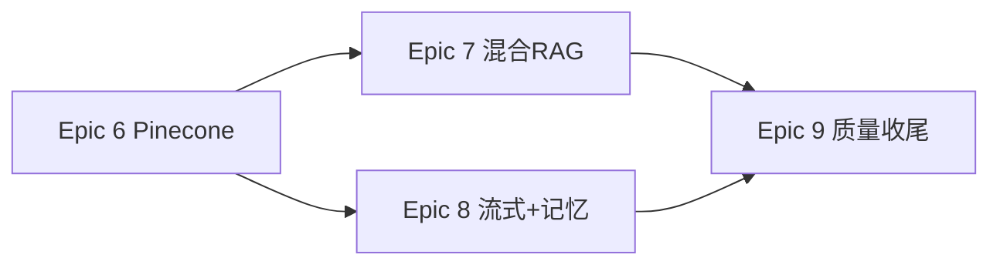

# 项目方案 v2（实施设计 — 理想态补齐）

- 版本: 1.0
- 状态: **执行中**（用户已批准，Epic 6–9 编码）
- 依据: `project-prompt.md`
- 基线代码: 分支 `cursor/upgrade-ai-agent-to-production-6f59`（Epic 0–5 已完成）

---

## 1. 现状评估（相对理想态）

### 1.1 已具备（可复用，不必推倒重来）

| 模块 | 状态 |
|------|------|
| FastAPI 路由骨架、鉴权、限流、CORS、护栏管道 | ✅ 已接入主路由（流式除外） |
| LangGraph `/chat` + Postgres 检查点 | ✅ |
| 文档上传 ETL + pgvector 写入 | ✅（需改为 Pinecone 主路径） |
| `/rag/query` 单向量检索 + 可选生成 | ✅（缺混合检索） |
| `/agent` ReAct + 工具 | ✅（`memory=None`） |
| ModelRouter、熔断、Prometheus、Langfuse、OTel span | ✅ |
| Docker/gunicorn/Compose/K8s 样例 | ✅（Compose 需去 Milvus化） |
| 测试 56 项 + CI | ✅ |

### 1.2 与理想态差距（本方案要补齐）

| 编号 | 差距 | 优先级 |
|------|------|--------|
| G1 | **Pinecone 未实现**（`factory` 直接 `NotImplementedError`） | P0 |
| G2 | **RAG 主链路未用混合检索**（`RagService` 仅 `VectorStore.search`；`MultiRetriever` 未接线） | P0 |
| G3 | **`/chat/stream` 绕过 LangGraph 与护栏** | P0 |
| G4 | **`/agent` 未接 MemoryManager** | P1 |
| G5 | **RAG 评估脚本为 stub**，未调真实 `RagService` | P1 |
| G6 | **文档删除未同步删向量**；列表无租户过滤 | P1 |
| G7 | **全量 mypy 未门禁** | P2 |
| G8 | **OTel 无 OTLP Exporter**（仅进程内 span） | P2 |
| G9 | **Milvus 遗留** 与 README/Compose 叙事不一致 | P2 |
| G10 | **长期记忆向量** 若仍指 pgvector，需改为 Pinecone 或明确废弃 | P1 |

---

## 2. 目标架构（v2）

```
                    ┌─────────────────────────────────────┐
  HTTP Clients      │  FastAPI + Middleware               │
  (无前端)          │  auth · limit · guardrails · metrics │
                    └──────────────┬──────────────────────┘
                                   │
         ┌─────────────────────────┼─────────────────────────┐
         ▼                         ▼                         ▼
   /chat, /chat/stream      /documents/*              /rag/query, /agent
         │                         │                         │
         ▼                         ▼                         ▼
   LangGraph Graph          ETL → Embed              HybridRetriever
   + Postgres CP            → VectorStore            ├─ Pinecone (vector)
         │                   → Postgres meta          ├─ BM25 (tenant corpus)
         │                         │                  └─ RRF → Rerank? → Generate
         ▼                         ▼
   ModelRouter              namespace=tenant_id
```

### 2.1 ADR：向量库以 Pinecone 为主

| 决策项 | 选择 | 说明 |
|--------|------|------|
| 生产默认 | `VECTOR_STORE=pinecone` | 托管、免运维 HNSW、易扩缩；符合「热门托管向量库」诉求 |
| 本地/CI 降级 | `VECTOR_STORE=pgvector` | 无网络/无 Key 时仍可跑集成测试 |
| 租户隔离 | Pinecone **namespace per tenant_id** | 简单可靠；metadata 冗余存 `document_id`, `chunk_index` |
| Index | 单 index 多 namespace（或每环境一 index） | 维度与 `EMBEDDING_DIM` 一致，创建脚本写入部署文档 |
| ID 策略 | `vector_id` = `document_chunks.id`（UUID） | 与 Postgres 一致，便于删除 |

**不采用双写**（pgvector + Pinecone 同时写）：增加一致性负担；仅保留端口切换。

### 2.2 ADR：混合检索落地方式

废弃「仅 Milvus 版 `MultiRetriever`」作为主实现，新增 **`HybridRetriever`**（或重构 `RagService`）：

```
query
  ├─► embed_query → VectorStore.search (Pinecone)     → list A
  ├─► BM25Index.search (tenant-scoped, built from PG)  → list B
  └─► RRF fuse → optional CrossEncoder rerank → contexts
```

- **BM25 语料**：从 Postgres `document_chunks` 按 `tenant_id` 加载（`documents` 表增加 `tenant_id` 字段，或通过 metadata 关联）。上传/删除时 **增量更新** BM25 索引（进程内 LRU，每租户上限 N 条，防 OOM）。
- **不再依赖 Milvus** 作为向量后端。

### 2.3 ADR：流式对话

- 方案 A（推荐）：LangGraph `astream_events` / 自定义 `model_fn` 流式回调，统一走 graph + 检查点 + 护栏（输入前置、输出后置校验）。
- 方案 B（不推荐）：维持直连 OpenAI stream — 与理想态不符，不采用。

### 2.4 数据模型变更

| 变更 | 说明 |
|------|------|
| `documents.tenant_id` | VARCHAR，非空，默认从请求上下文写入 |
| `document_chunks` | 已有 `vector_id`；确保与 Pinecone id 一致 |
| 可选 `conversations.tenant_id` | 若会话表启用，便于审计 |
| Alembic | 新迁移 `0003_add_tenant_id_to_documents.py` |

LangGraph 检查点表不变（仍 Postgres）。

---

## 3. 实施阶段（Epic 6–9，审核后执行）

> Epic 0–5 视为 **Baseline**；以下为 **v2 增量**。每故事格式：目标 → 改动范围 → 验证。

### Epic 6 — Pinecone 向量库（P0）预计 5–8 个故事

| ID | 故事 | 改动要点 | 验证 |
|----|------|----------|------|
| S6.1 | 实现 `PineconeVectorStore` | `app/infrastructure/vectordb/pinecone_store.py`：upsert/search/delete/close；metadata 过滤 | 单测 mock SDK；可选集成测（需 Key） |
| S6.2 | 工厂与配置 | `build_vector_store()` 支持 pinecone；`PINECONE_API_KEY`, `PINECONE_INDEX`, `PINECONE_HOST` 等 | 配置校验失败时启动报错明确 |
| S6.3 | 文档上传写入 Pinecone | `document.py` 使用 factory；namespace=tenant | 集成测：上传后 search 命中 |
| S6.4 | 文档删除 + 向量清理 | `DELETE /documents/{id}`；删 PG + Pinecone | 删后 search 无命中 |
| S6.5 | 租户隔离测试 | 两租户数据互不可见 | 集成测必过 |
| S6.6 | 就绪探针 | `/health/ready` 增加 Pinecone 探测（describe_index_stats 或 upsert 探针） | ready 字段 `vector_store: up/down` |
| S6.7 | Compose 与文档 | 去掉 Milvus 服务；README/deployment 写 Pinecone 建 index 步骤 | 文档评审 |
| S6.8 | pgvector 降级路径 | 明确 `VECTOR_STORE=pgvector` 仍可用；CI 默认 pgvector 无需 Key | CI 全绿 |

### Epic 7 — RAG 混合检索与评估（P0）预计 4–6 个故事

| ID | 故事 | 改动要点 | 验证 |
|----|------|----------|------|
| S7.1 | `HybridRetriever` 接入 `RagService` | 向量路接 VectorStore；BM25 路接 PG 语料 | 单测：RRF 排序正确 |
| S7.2 | 上传/删除维护 BM25 索引 | 与 S6.4 联动 | 上传后 BM25 可检索 |
| S7.3 | `/rag/query` 端到端 | 租户 + 护栏 + 混合检索 | 集成测 |
| S7.4 | 黄金集接真实管道 | `eval_rag_golden.py` 调用 `RagService` | CI fail-under ≥ 0.8 |
| S7.5 | 重排开关与依赖 | 默认 off；文档说明 sentence-transformers 可选 | CI 不装 torch 仍绿 |

### Epic 8 — 对话流式与 Agent 记忆（P0/P1）预计 4–5 个故事

| ID | 故事 | 改动要点 | 验证 |
|----|------|----------|------|
| S8.1 | `/chat/stream` 走 LangGraph | 统一 thread_id、检查点 | 流式 + 重启后会话仍在 |
| S8.2 | 流式护栏策略 | 输入前置；输出：缓冲后 `check_output_safety` 或违规事件 | 单测 + 手工 SSE |
| S8.3 | `/agent` 接 MemoryManager | Redis 短期；长期召回走 VectorStore（Pinecone） | 单测 mock memory |
| S8.4 | Agent 集成测 | 多轮 agent 记住上下文 | 可选，依赖 Redis |

### Epic 9 — 工程质量与可观测收尾（P1/P2）预计 3–5 个故事

| ID | 故事 | 改动要点 | 验证 |
|----|------|----------|------|
| S9.1 | `mypy app` 清零 + CI | 修 7 文件历史债 | CI mypy 全库 |
| S9.2 | OTel OTLP（可选） | `OTEL_EXPORTER_OTLP_ENDPOINT` | 本地 Collector 可收 span |
| S9.3 | 列表/查询租户过滤 | documents 列表、RAG 仅本租户 | 安全测试 |
| S9.4 | 废弃 Milvus 代码路径 | 标记 deprecated 或移入 `legacy/` | import 无破坏 |
| S9.5 | OpenAPI 示例与 Postman 集合 | `docs/api-examples.md` | 人工评审 |

---

## 4. 配置清单（v2 新增/变更）

```env
# 向量库（生产默认 pinecone）
VECTOR_STORE=pinecone
PINECONE_API_KEY=
PINECONE_INDEX=agent-knowledge
PINECONE_HOST=          # Serverless 区域 host，按控制台填写
PINECONE_NAMESPACE_PREFIX=tenant   # 实际 namespace = tenant_id

# 降级
VECTOR_STORE=pgvector   # 仅本地/CI

# RAG
RAG_HYBRID_ENABLED=true
RAG_BM25_MAX_DOCS_PER_TENANT=10000

# 流式
CHAT_STREAM_BUFFER_MAX_CHARS=8000
```

---

## 5. 测试策略

| 层级 | 策略 |
|------|------|
| 单元 | Mock Pinecone SDK、`HybridRetriever`、护栏、BM25 |
| 集成 | 默认 CI 用 pgvector；nightly workflow 可选真实 Pinecone secret |
| E2E | httpx 覆盖四条链路 + 租户隔离 + 删除文档 |
| 评估 | 黄金集 ≥10 条，接真实 `RagService`，阈值 0.8 |

---

## 6. 风险与缓解

| 风险 | 缓解 |
|------|------|
| Pinecone 费用/限流 | namespace 清理策略；top_k 上限；监控 query 量 |
| CI 依赖外网 | 默认 pgvector job；Pinecone job 可选 |
| BM25 内存膨胀 | 每租户文档上限 + LRU 驱逐 |
| 流式重构工作量大 | 先非流式完全对齐，流式作为 S8.1 独立 PR |
| 维度变更 | 嵌入维度变更需新建 index + 全量 re-embed 文档 |

---

## 7. 交付物清单（编码阶段结束时应有）

- [ ] `PineconeVectorStore` + 测试
- [ ] `HybridRetriever` 接入 `/rag/query`
- [ ] `/chat/stream` 与 `/chat` 行为对齐
- [ ] `/agent` 记忆接入
- [ ] `DELETE /documents/{id}` + 租户字段迁移
- [ ] 评估脚本 + CI 阈值
- [ ] 更新 `sprint-plan.md`（Epic 6–9）
- [ ] 更新 `prd.md` / `architecture.md` 向量库章节为 Pinecone 主

---

## 8. 建议执行顺序（审核通过后）



1. **Epic 6** 先落地 Pinecone，否则后续 RAG/记忆都依赖向量端口。
2. **Epic 7** 混合检索是 PRD 核心差异点。
3. **Epic 8** 可与 Epic 7 部分并行（不同文件）。
4. **Epic 9** 收尾合并到 `main`。

---

## 9. 工作量说明（不给日历估时）

- **改动面**：主要集中在 `infrastructure/vectordb`、`core/rag`、`api/routes/chat.py`、`document.py`、Alembic 迁移。
- **侵入性**：中等；不推翻 Epic 0–5，在端口与路由层扩展。
- **对外破坏性**：`VECTOR_STORE` 默认改为 `pinecone` 后，现有仅 pgvector 的部署需配置 Pinecone 或显式设回 pgvector。

---

## 10. 审核检查表（请你勾选）

- [ ] 同意 **纯后端、无前端** 边界
- [ ] 同意 **Pinecone 为生产默认向量库**，pgvector 仅降级
- [ ] 同意 **混合检索 RRF** 作为 `/rag/query` 标准路径
- [ ] 同意 **流式对话改走 LangGraph**（接受一定重构量）
- [ ] 同意 **Epic 6–9 优先级与顺序**
- [ ] 对「待确认问题」（见 `project-prompt.md` §11）给出选择

**你回复「同意，按方案执行」或逐条修改意见后，再开始写代码。**
