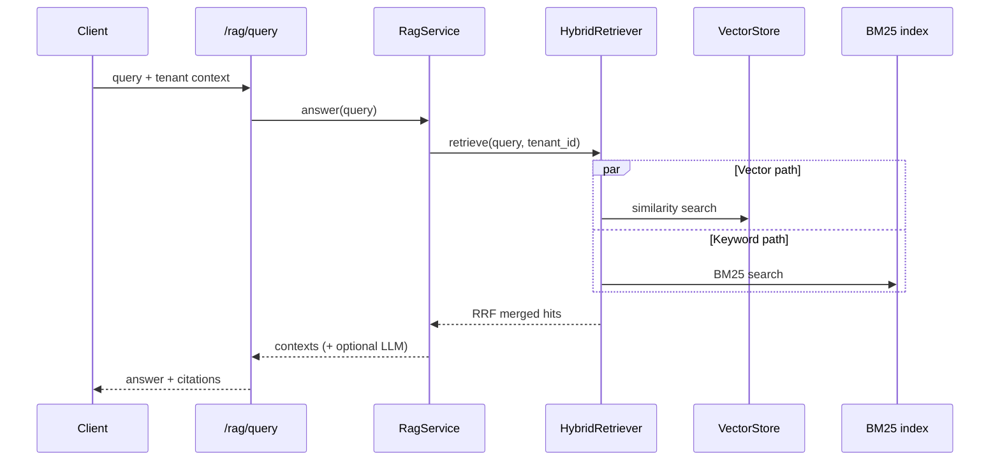

# Enterprise AI Agent API

[](https://github.com/lordrance/AI-Agent-service/actions/workflows/ci.yml)

**Backend-only** enterprise AI agent service: multi-turn chat, document ingestion, hybrid RAG, and ReAct agents over HTTP/JSON and SSE.  
Designed as a **portfolio / interview-grade** codebase with clear layering, **61 pytest cases**, and a CI gate on real RAG retrieval quality.

There is **no frontend** in this repository — bring your own UI or call the API from curl, Postman, or any backend.

---

## Table of contents

- [What you can demo](#what-you-can-demo)
- [System architecture](#system-architecture)
- [Project structure](#project-structure)
- [Quick start](#quick-start)
- [Configuration](#configuration)
- [API overview](#api-overview)
- [Testing & quality](#testing--quality)
- [Production deployment](#production-deployment)
- [Extending the codebase](#extending-the-codebase)

---

## What you can demo

| Feature | Endpoint | Engineering note |
|---------|----------|------------------|
| Multi-turn chat | `POST /api/v1/chat` | LangGraph graph + `AsyncPostgresSaver` checkpoints |
| Streaming chat | `POST /api/v1/chat/stream` | SSE via `ModelRouter.chat_stream`; output guardrails after buffer |
| Document ingest | `POST /api/v1/documents/upload` | ETL → chunk → embed → `VectorStore` + SQL metadata |
| Hybrid RAG | `POST /api/v1/rag/query` | Pinecone/pgvector **+ BM25 + RRF**; optional citation-style generation |
| Tool agent | `POST /api/v1/agent` | ReAct with step/time limits; optional `use_memory` |
| Ops | `/health`, `/health/ready`, `/metrics` | Dependency probes + Prometheus |

---

## System architecture

### Layered design

```
┌─────────────────────────────────────────────────────────────┐
│  API (FastAPI)                                               │
│  routes · auth · rate limit · guardrails · request context     │
└───────────────────────────┬─────────────────────────────────┘
                            │
┌───────────────────────────▼─────────────────────────────────┐
│  Core (framework-agnostic domain logic)                      │
│  LangGraph · RagService · HybridRetriever · ReActAgent       │
│  MemoryManager · guardrails · intent                         │
└───────────────────────────┬─────────────────────────────────┘
                            │
┌───────────────────────────▼─────────────────────────────────┐
│  Infrastructure (adapters)                                   │
│  ModelRouter · VectorStore (Pinecone | pgvector)             │
│  PostgreSQL · Redis · embeddings · OTel · Prometheus         │
└─────────────────────────────────────────────────────────────┘
```

### Vector store abstraction

Production and local environments swap implementations via **`VectorStore`** port + factory:

| `VECTOR_STORE` | Use case |
|----------------|----------|
| `pinecone` | Managed vectors; **namespace = `tenant_id`** |
| `pgvector` | Local dev, CI, integration tests (no external vector SaaS) |

### Hybrid RAG pipeline



BM25 uses **character-level tokenization for CJK** so Chinese FAQ-style corpora rank correctly in tests and golden-set eval.

### Chat persistence

- LangGraph `thread_id` format: `{tenant_id}:{conversation_id}`
- Checkpoints stored in PostgreSQL (`langgraph-checkpoint-postgres`)
- Stream and non-stream paths share guardrails; stream appends final turn via `aupdate_state`

---

## Project structure

```
project-python/
├── app/
│   ├── main.py                      # App factory, lifespan, OTel bootstrap
│   ├── config.py                    # pydantic-settings
│   ├── api/
│   │   ├── routes/                  # chat, document, rag, agent, health
│   │   ├── auth.py · middleware_stack.py
│   │   └── context.py               # tenant / trace contextvars
│   ├── core/
│   │   ├── langgraph/               # Chat graph + checkpoint helpers
│   │   ├── rag/                     # HybridRetriever, RagService, BM25 registry
│   │   ├── agent/                   # ReAct agent
│   │   ├── memory/                  # Redis STM + vector LTM
│   │   └── guardrails/
│   ├── infrastructure/
│   │   ├── vectordb/                # PineconeVectorStore, PgVectorStore, factory
│   │   ├── llm/                     # ModelRouter, circuit breaker
│   │   ├── database/                # SQLAlchemy models, sessions
│   │   ├── trace/                   # OTel GenAI spans, OTLP setup
│   │   └── metrics/
│   ├── etl/                         # Document parsing & chunking
│   └── models/                      # Pydantic schemas
├── alembic/versions/                # Schema + pgvector + tenant_id
├── tests/                           # 61 tests (see below)
├── scripts/
│   ├── eval_rag_golden.py           # Real-pipeline RAG eval (CI gate)
│   └── smoke_deploy.sh
├── docker-compose.yml
├── Dockerfile
└── docs/
    ├── deployment.md
    └── api-examples.md
```

---

## Quick start

### Prerequisites

- Python **3.11+**
- PostgreSQL **16** with **pgvector**
- Redis **7+**

### Install

```bash
cd project-python
python -m venv .venv
source .venv/bin/activate   # Windows: .venv\Scripts\activate

pip install -r requirements.txt
pip install -e ".[dev]"

cp .env.example .env
# Minimum: DATABASE_URL, REDIS_URL
# For LLM generation: OPENAI_API_KEY

alembic upgrade head
uvicorn app.main:app --reload --host 0.0.0.0 --port 8000
```

- Health: http://127.0.0.1:8000/api/v1/health  
- Swagger UI: http://127.0.0.1:8000/docs  

### Docker Compose

```bash
docker compose up -d --build
./scripts/smoke_deploy.sh http://127.0.0.1:8000
```

Stack: **app** (Gunicorn) + **postgres (pgvector)** + **redis**. Default `VECTOR_STORE=pgvector`.

---

## Configuration

| Variable | Description |
|----------|-------------|
| `DATABASE_URL` | Async Postgres URL (`postgresql+asyncpg://...`) |
| `REDIS_URL` | Redis for STM / optional rate-limit backend |
| `OPENAI_API_KEY` | Required for chat generation and RAG answers |
| `VECTOR_STORE` | `pgvector` (dev/CI) or `pinecone` (production) |
| `PINECONE_API_KEY` / `PINECONE_INDEX` / `PINECONE_HOST` | Pinecone when `VECTOR_STORE=pinecone` |
| `AUTH_ENABLED` | Enable API Key / JWT (`false` in local dev) |
| `API_KEYS` | e.g. `tenant-a:secret-a,tenant-b:secret-b` |
| `RAG_HYBRID_ENABLED` | `true` → vector + BM25 + RRF |
| `OTEL_ENABLED` / `OTEL_EXPORTER_OTLP_ENDPOINT` | Optional distributed tracing |

See [`.env.example`](./.env.example) for the full list.

### Pinecone (production)

1. Create an index with dimension **`EMBEDDING_DIM`** (default **1536**).
2. Set:

```env
VECTOR_STORE=pinecone
PINECONE_API_KEY=...
PINECONE_INDEX=agent-knowledge
PINECONE_HOST=...   # Serverless regional host from console
```

Each tenant maps to a Pinecone **namespace** aligned with `tenant_id`.

---

## API overview

| Method | Path | Description |
|--------|------|-------------|
| `GET` | `/api/v1/health` | Liveness |
| `GET` | `/api/v1/health/ready` | DB + Redis + vector store |
| `POST` | `/api/v1/chat` | Multi-turn chat |
| `POST` | `/api/v1/chat/stream` | SSE streaming chat |
| `POST` | `/api/v1/documents/upload` | Upload & index document |
| `GET` | `/api/v1/documents` | List documents (current tenant) |
| `DELETE` | `/api/v1/documents/{id}` | Delete document + vectors |
| `POST` | `/api/v1/rag/query` | Hybrid RAG Q&A |
| `POST` | `/api/v1/agent` | ReAct agent (`use_memory` optional) |
| `GET` | `/api/v1/metrics` | Prometheus metrics |

**Example — RAG query (no auth):**

```bash
curl -s -X POST http://127.0.0.1:8000/api/v1/rag/query \
  -H "Content-Type: application/json" \
  -d '{"query": "What is the refund policy?"}'
```

More examples: [docs/api-examples.md](./docs/api-examples.md).

---

## Testing & quality

### Test suite (61 tests)

```bash
alembic upgrade head
pytest tests/ -v
```

| Area | Example files |
|------|----------------|
| Vector store / Pinecone | `test_s1_1_vectorstore.py`, `test_s6_pinecone.py` |
| Document ingest | `test_s1_2_document_ingest.py` |
| LangGraph chat | `test_s1_3_chat_graph.py` |
| RAG | `test_s1_4_rag.py`, `test_s7_hybrid_rag.py` |
| Agent | `test_s1_5_agent.py` |
| Auth / security / guardrails | `test_s3_*.py` |
| Observability / resilience | `test_s4_*.py` |
| Deploy | `test_s5_deploy.py` |
| Golden-set CI gate | `test_s9_eval_pipeline.py` |

### RAG golden-set evaluation

Indexes fixture contexts into the **real** `RagService` + `HybridRetriever`, then scores retrieval accuracy:

```bash
python scripts/eval_rag_golden.py --dry-run
python scripts/eval_rag_golden.py --mode pipeline --fail-under 0.8
```

CI enforces **accuracy ≥ 0.8** on `scripts/fixtures/golden_rag_sample.jsonl` (10 cases).

### Lint

```bash
ruff check app tests scripts
ruff format --check app tests scripts
```

---

## Production deployment

- Multi-stage **Dockerfile** (non-root, `HEALTHCHECK`, Gunicorn)
- **Kubernetes** samples under `deploy/kubernetes/`
- Guide: [docs/deployment.md](./docs/deployment.md)

---

## Extending the codebase

| Goal | Start here |
|------|------------|
| Add an agent tool | `app/core/tools/` + register in `api/routes/agent.py` |
| Change retrieval | `app/core/rag/hybrid_retriever.py`, `bm25_registry.py` |
| New vector backend | Implement `VectorStore` in `app/infrastructure/vectordb/` |
| Chat behavior | `app/core/langgraph/graph.py`, `model.py` |
| Product specs | `../docs/planning-artifacts/project-prompt.md` |

After changes: run `pytest` and `eval_rag_golden.py --mode pipeline`.

---

## Related documentation

- [Deployment guide](./docs/deployment.md)
- [API examples](./docs/api-examples.md)
- [Repository root README](../README.md)

---

## License

MIT
